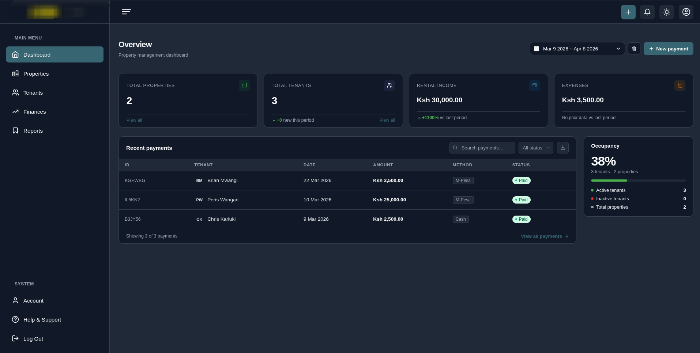
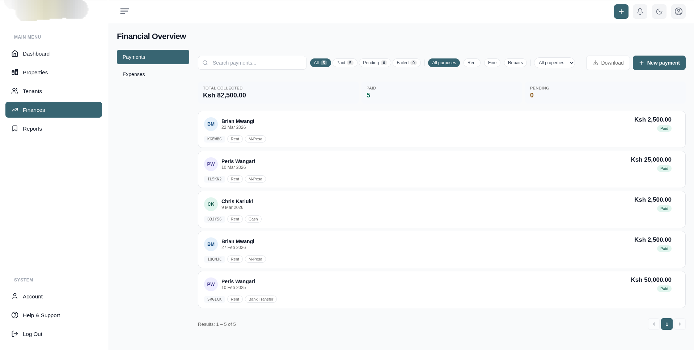
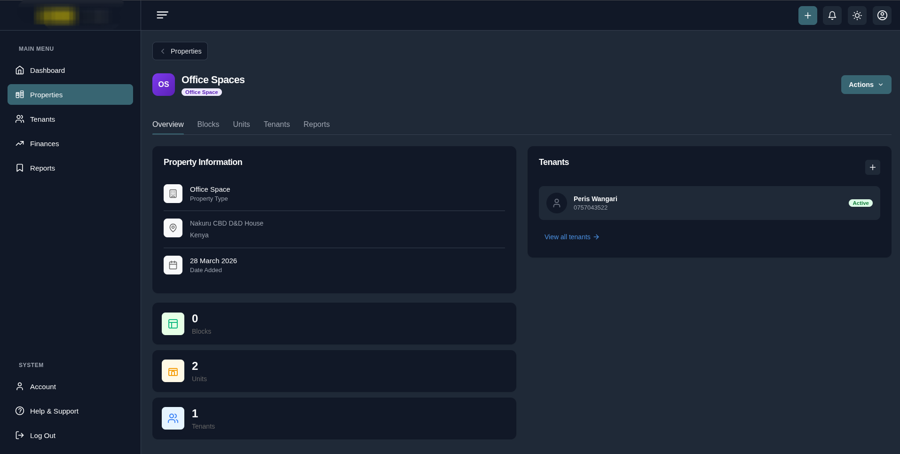
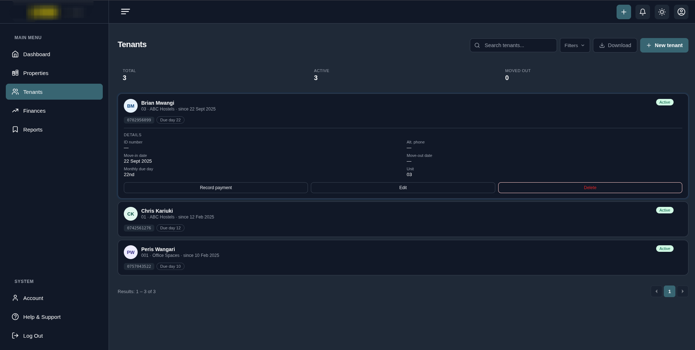
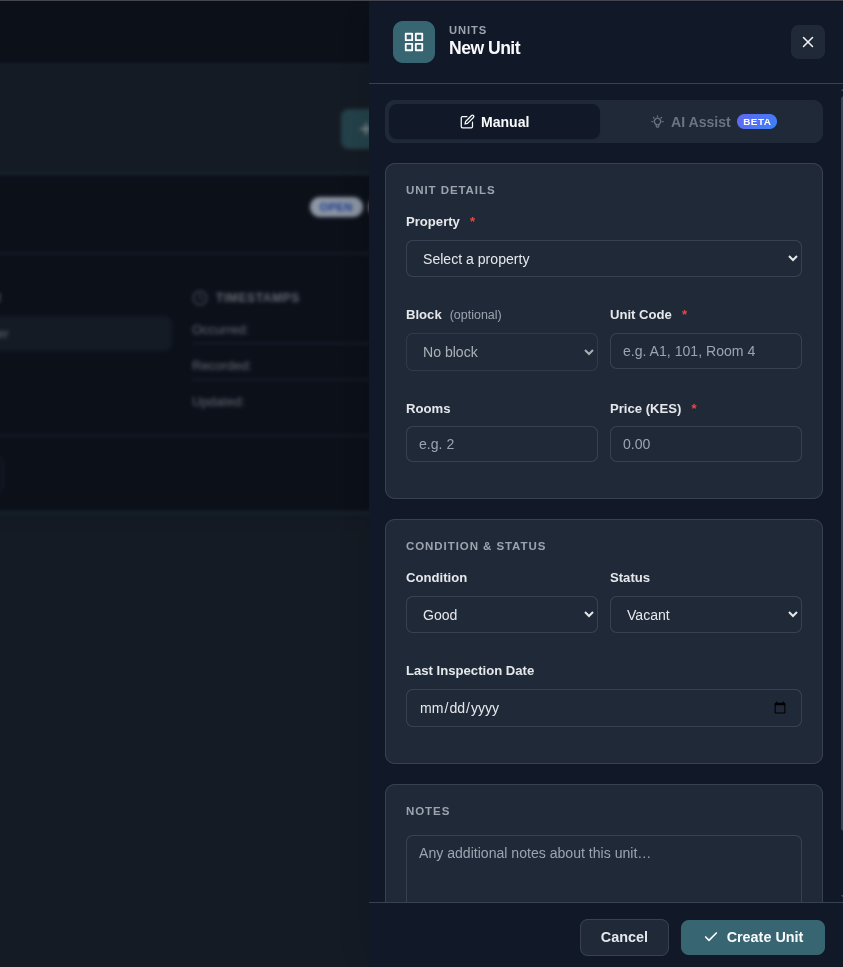
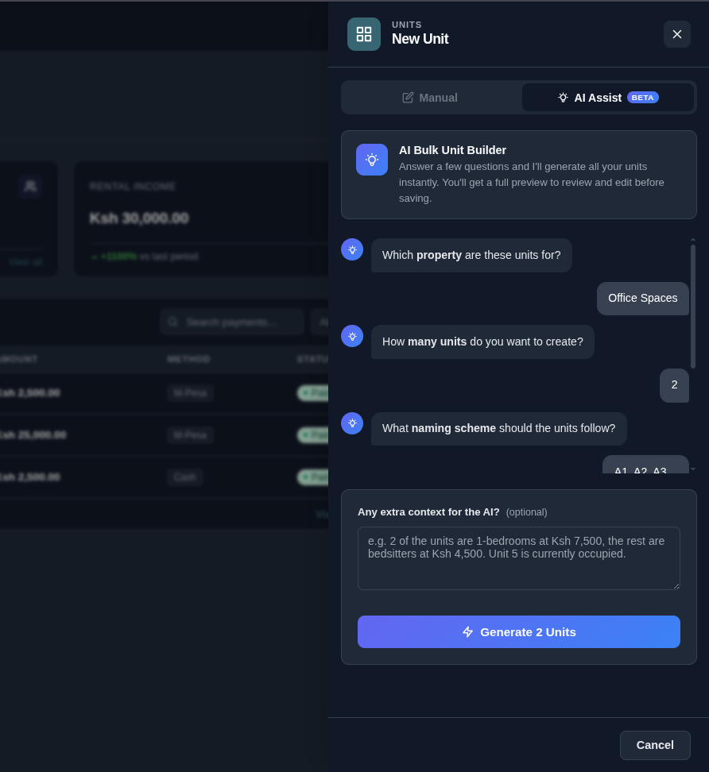
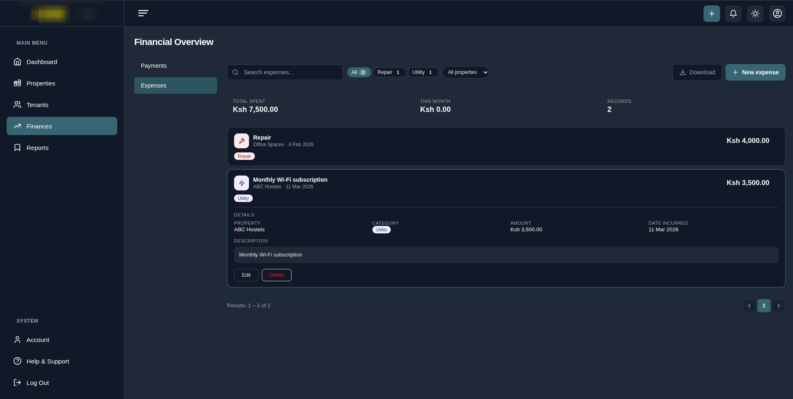

**Nyumba360** is a property management solution that simplifies property management with features like tenant management, income & expense tracking, and M-Pesa payment reconciliation among others. Built with modern web technologies and tailored for the Kenyan market.

**[Try the Live Demo →](#)**

---

## About This Project

This project was initially developed as a SaaS product but is being shared as a portfolio project. It showcases:

- **Full-stack architecture** with separated backend (Django REST) and frontend (Vue.js)
- **Payment integration** with M-Pesa Daraja API
- **Production-ready deployment** using Docker and Nginx
- **Clean API design** following REST principles

Perfect for potential users looking for a self-hosted property management solution.

---

## Features

### Property & Tenant Management

- **Properties** - Manage multiple properties with detailed information
- **Units** - Track individual rental units within properties
- **Tenants** - Complete tenant profiles and assignment to units

### Financial Tracking

- **Income Tracking** - Record and monitor all rental income
- **Payment Management** - Track payments from tenants
- **M-Pesa Transactions** - Automatic capture of M-Pesa payments via Paybill
- **Expense Management** - Record expenses with receipt storage
- **Report Linking** - Connect expenses to maintenance reports for full accountability

### Maintenance & Reporting

- **Maintenance Reports** - Create and manage maintenance reports
- **Receipt Storage** - Store receipts for expenses and other documents

### Communication

- **SMS Alerts** - Send automated alerts to tenants
- **Bulk Messaging** - Send messages to multiple tenants at once

### Premium Feature (Available for Implementation)

- **Automatic M-Pesa Reconciliation** - Fully automated payment matching via Paybill integration _(implementation available for a fee)_

---

## Getting Started

### For Users

1. **Visit**: [#]
2. **Sign up** with:
   - Full name
   - Phone number
   - 4-digit PIN
3. **Explore with demo data** - Your account comes pre-loaded with sample properties, tenants, and payments
4. **Start fresh** - Delete demo data with a single click when ready to add your own properties

### Screenshots

_Dark mode interface - new accounts include realistic demo data to explore majority of the features_

_Light mode alternative for different preferences and lighting conditions_

_Comprehensive property dashboard showing detailed information, units, and financial summaries at a glance_

_Dedicated tenants page for managing tenant profiles_

_Intuitive drawer panel for quick unit creation without leaving the current view_

_Bulk unit creation powered by LLM - describe your units in natural language and let AI generate the structured data_

_Track and categorize all property-related expenses from the dedicated Finances tab_

---

## Code Repositories

The codebase is separated into two independent repositories:

- **[Backend (Django REST API)](https://github.com/verybrian/nyumba360-api)** - Django REST Framework, PostgreSQL, M-Pesa integration
- **[Frontend (Vue.js)](https://github.com/verybrian/nyumba360-web)** - Vue.js SPA with Pinia state management

Each repository can be developed and deployed independently.

---

## Tech Stack

### Backend

- **Django**
- **Django REST Framework**
- **PostgreSQL**
- **M-Pesa Daraja API**

### Frontend

- **Vue.js**
- **Pinia**

### DevOps & Infrastructure

- **Docker**
- **Docker Compose**
- **Nginx**

---

### Custom Implementation Available

I'm available to implement the premium automatic Paybill reconciliation feature for your installation. This includes:

- Automated payment matching
- Real-time payment updates
- Custom reconciliation rules

Contact me for pricing and implementation details.

---

## Contact

- **GitHub**: [github.com/verybrian/nyumba360](https://github.com/verybrian/nyumba360)
- **Email**: verybrian@duck.com
- **LinkedIn**: [linkedin.com/in/verybrian](https://linkedin.com/in/verybrian)

---

**Note**: This project was originally planned as a commercial SaaS product but is being shared as a portfolio project. It's fully functional and production-ready, though ongoing support is not guaranteed.
